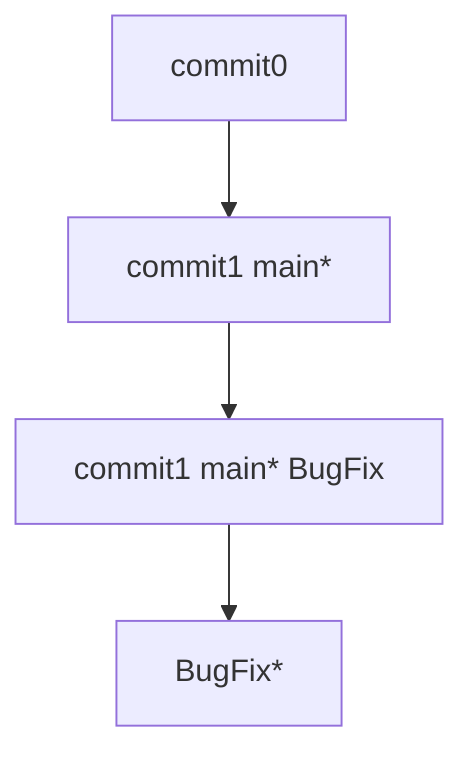
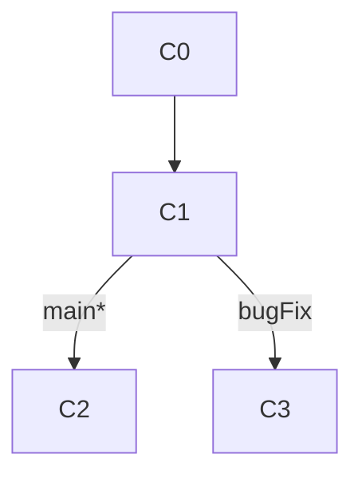
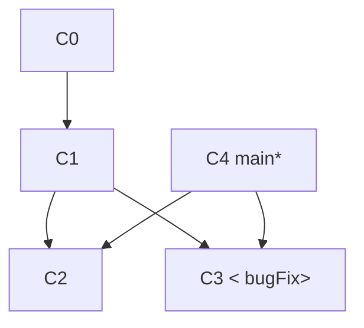
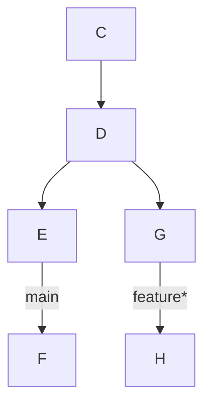
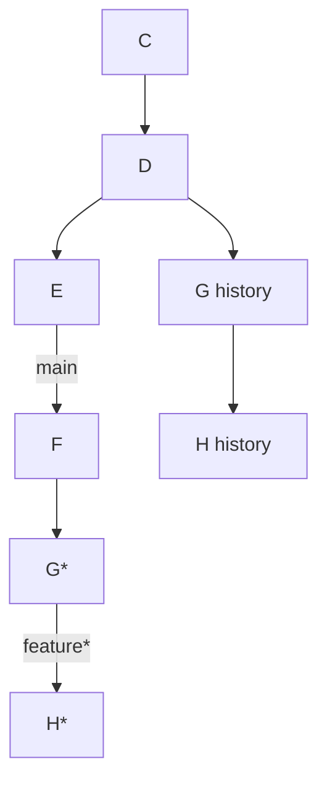
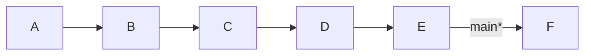
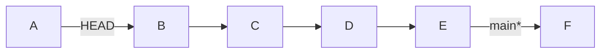
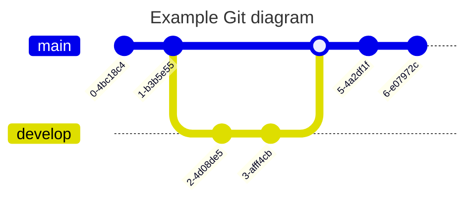

---


## What is a Git repository?

---

A [Git repository](https://bitbucket.org/product/code-repository) is a virtual storage of your project. It allows you to save versions of your code, which you can access when needed. 

## workflow

your local repository consists of three "trees" maintained by git. the first one is your `Working Directory` which holds the actual files. the second one is the `Index` which acts as a staging area and finally the `HEAD` which points to the last commit you've made. [1](https://rogerdudler.github.io/git-guide/)


## Initializing a new repository: git init

---

To create a new repo, you'll use the `git init` command. `git init` is a one-time command you use during the initial setup of a new repo. Executing this command will create a new `.git` subdirectory in your current working directory. This will also create a new main branch. 

### Versioning an existing project with a new git repository

This example assumes you already have an existing project folder that you would like to create a repo within. You'll first `cd` to the root project folder and then execute the `git init` command.


###### RELATED MATERIAL

#### Git branch

[Read article](https://www.atlassian.com/git/tutorials/using-branches)


###### SEE SOLUTION

#### Learn Git with Bitbucket Cloud

[Read tutorial](https://www.atlassian.com/git/tutorials/learn-git-with-bitbucket-cloud)

```bash
cd /path/to/your/existing/code 
git init
```

Pointing `git init` to an existing project directory will execute the same initialization setup as mentioned above, but scoped to that project directory.

```xml
git init <project directory>
```

Visit the [git init](https://www.atlassian.com/git/tutorials/setting-up-a-repository/git-init) page for a more detailed resource on `git init`.

-------

## Cloning an existing repository: git clone

---

If a project has already been set up in a central repository, the clone command is the most common way for users to obtain a local development clone. Like `git init`, cloning is generally a one-time operation. Once a developer has obtained a working copy, all [version control](https://bitbucket.org/product/version-control-software) operations are managed through their local repository.

```bash
git clone <repo url>
```

`git clone` is used to create a copy or clone of remote repositories. You pass `git clone` a repository URL. Git supports a few different network protocols and corresponding URL formats. In this example, we'll be using the Git SSH protocol. Git SSH URLs follow a template of: `git@HOSTNAME:USERNAME/REPONAME.git`

An example Git SSH URL would be: `git@bitbucket.org:rhyolight/javascript-data-store.git` where the template values match:

- `HOSTNAME: bitbucket.org`
- `USERNAME: rhyolight`
- `REPONAME: javascript-data-store`

When executed, the latest version of the remote repo files on the main branch will be pulled down and added to a new folder. The new folder will be named after the REPONAME in this case `javascript-data-store`. The folder will contain the full history of the remote repository and a newly created main branch.

For more documentation on `git clone` usage and supported Git URL formats, visit the [git clone Page](https://www.atlassian.com/git/tutorials/setting-up-a-repository/git-clone).

----------
## Some commands:

### Git commit;

 What commit does is basically create a pointer to the current snapshot of repository.

### Git branch
git branch basically creates a new branch of the current repo to keep a separate track of including it's preceding commit.

'Branches in Git are incredibly lightweight as well. They are simply pointers to a specific commit -- nothing more. This is why many Git enthusiasts chant the mantra:

```
branch early, and branch often
```

Because there is no storage / memory overhead with making many branches, it's easier to logically divide up your work than have big beefy branches.

When we start mixing branches and commits, we will see how these two features combine. For now though, just remember that a branch essentially says "I want to include the work of this commit and all parent commits."

3. Now let's say we wrote some code in current repo. and did a commit. now we want to branch it out from here.	```

```
git branch bugFix(branchname)
git checkout bugFix(branchname)
```

What this does is create a branch first pointing to a particular commit and then checkout means changing the current pointer to the new branch name.



### Git remote:

A remote repo is already setup in github in this case. we need to tell git where to etch and push it to for now.

```bash
vaibhav@Vaibhavs-MBP gitworkspace % git remote -v
vaibhav@Vaibhavs-MBP gitworkspace % git remote
vaibhav@Vaibhavs-MBP gitworkspace % git remote add appliedDataScience https://github.com/imvaibhav28/AppliedDataScience
vaibhav@Vaibhavs-MBP gitworkspace % git remote -v
appliedDataScience	https://github.com/imvaibhav28/AppliedDataScience (fetch)
appliedDataScience	https://github.com/imvaibhav28/AppliedDataScience (push)
vaibhav@Vaibhavs-MBP gitworkspace %
```

### git status [1](https://git-scm.com/book/en/v2/Git-Basics-Recording-Changes-to-the-Repository)

The main tool you use to determine which files are in which state is the `git status` command. If you run this command directly after a clone, you should see something like this:

```bash
vaibhav@Vaibhavs-MBP gitworkspace % git status
On branch main
Untracked files:
  (use "git add <file>..." to include in what will be committed)
	peepcode-git.pdf

nothing added to commit but untracked files present (use "git add" to track)
```


### Git merge

Great! We now know how to commit and branch. Now we need to learn some kind of way of combining the work from two different branches together. This will allow us to branch off, develop a new feature, and then combine it back in.

The first method to combine work that we will examine is `git merge`. Merging in Git creates a special commit that has two unique parents. A commit with two parents essentially means "I want to include all the work from this parent over here and this one over here, _and_ the set of all their parents."

Here we have two branches; each has one commit that's unique. This means that neither branch includes the entire set of "work" in the repository that we have done. Let's fix that with merge.

We will `merge` the branch `bugFix` into `main`.


Fig1 

```git
git merge bugFix
```




`main` now points to a commit C4 that has two parents. If you follow the arrows up the commit tree from `main`, you will hit every commit along the way to the root. This means that `main` contains all the work in the repository now.


###  Git Rebase

The second way of combining work between branches is _rebasing._ Rebasing essentially takes a set of commits, "copies" them, and plops them down somewhere else.

While this sounds confusing, the advantage of rebasing is that it can be used to make a nice linear sequence of commits. The commit log / history of the repository will be a lot cleaner if only rebasing is allowed.




Either of the following commands

```git
git rebase main
git rebase main feature
```

will do the following :




### HEAD
HEAD is the symbolic name for the currently _checked out_ commit -- it's essentially what commit you're working on top of.

HEAD always points to the most recent commit which is reflected in the working tree. Most git commands which make changes to the working tree will start by changing HEAD.

Normally HEAD points to a branch name (like bugFix). When you commit, the status of bugFix is altered and this change is visible through HEAD.

#### Detaching head

So `git checkout C4` C4 is hash of current commit detaches the HEAD from the branchname and makes it point to the commit instead.

#### Relative refs
Moving around in Git by specifying commit hashes can get a bit tedious. In the real world you won't have a nice commit tree visualization next to your terminal, so you'll have to use `git log` to see hashes.

Furthermore, hashes are usually a lot longer in the real Git world as well. For instance, the hash of the commit that introduced the previous level is `fed2da64c0efc5293610bdd892f82a58e8cbc5d8`. Doesn't exactly roll off the tongue...

The upside is that Git is smart about hashes. It only requires you to specify enough characters of the hash until it uniquely identifies the commit. So I can type `fed2` instead of the long string above.


Specifying commits by their hash isn't the most convenient thing ever, which is why Git has relative refs. They are awesome!

With relative refs, you can start somewhere memorable (like the branch `bugFix` or `HEAD`) and work from there.

Relative commits are powerful, but we will introduce two simple ones here:

- Moving upwards one commit at a time with `^`
- Moving upwards a number of times with `~<num>`

##### The "^" operator

Let's look at the Caret (^) operator first. Each time you append that to a ref name, you are telling Git to find the parent of the specified commit.

So saying `main^` is equivalent to "the first parent of `main`".

`main^^` is the grandparent (second-generation ancestor) of `main`

Let's check out the commit above main here.

`git checkout bugFix^`  will basically checkout the bugFix's parent commit here. This is like going back in time to see which branch's which commit had what changes.

##### The "~" operator

Say you want to move a lot of levels up in the commit tree. It might be tedious to type `^` several times, so Git also has the tilde (~) operator.

The tilde operator (optionally) takes in a trailing number that specifies the number of parents you would like to ascend. Let's see it in action.



`git checkout HEAD~5` 




### Branch forcing

Let's actually _use_ relative refs for something.

One of the most common ways to use relative refs is to move branches around. You can directly reassign a branch to a commit with the `-f` option. So something like:

`git branch -f main HEAD~3`

moves (by force) the main branch to three parents behind HEAD.

_Note: In a real git environment `git branch -f command` is not allowed for your current branch._


### Reversing Changes in Git


------




Sources
https://www.atlassian.com/git/tutorials/setting-up-a-repository

There are many ways to reverse changes in Git. And just like committing, reversing changes in Git has both a low-level component (staging individual files or chunks) and a high-level component (how the changes are actually reversed). Our application will focus on the latter.

There are two primary ways to undo changes in Git -- one is using `git reset` and the other is using `git revert`.

`git reset` reverses changes by moving a branch reference backwards in time to an older commit. In this sense you can think of it as "rewriting history;" `git reset` will move a branch backwards as if the commit had never been made in the first place.


While resetting works great for local branches on your own machine, its method of "rewriting history" doesn't work for remote branches that others are using.

In order to reverse changes and _share_ those reversed changes with others, we need to use `git revert`.


----

## Common git use cases and commands

#### 1. git status

`git status`
This command is used to check the status of your working directory and staging area. It shows which files are staged, unstaged, or untracked.

#### 2. git add

`git add`   
This command is used to add changes in your working directory to the staging area. You can specify individual files or use `git add .` to stage all changes.

#### 3. git commit
`git commit -m "Your commit message"`
This command is used to commit the staged changes to the repository. The `-m` flag allows you to include a commit message directly in the command.

#### 4. git push 
`git push origin main`
This command is used to push your local commits to a remote repository. Replace `origin` with the name of your remote and `main` with the branch you want to push to.

#### 5. git pull
`git pull origin main`
This command is used to pull changes from a remote repository to your local repository. It fetches the changes and merges them into your current branch.

#### 6. git branch
`git branch`
This command is used to list all branches in your repository. You can also create a new branch with `git branch <branch-name>`.

#### 7. git checkout
`git checkout <branch-name>`
This command is used to switch between branches.

#### 8. git merge
`git merge <branch-name>`
This command is used to merge changes from one branch into another.

#### 9. git log
`git log`
This command is used to display the commit history of your repository.

#### 10. git diff
`git diff`
This command is used to show the differences between your working directory and the staging area, or between two commits.


----


#### git switch
`git switch <branch-name>`
This command is used to switch branches in your repository. It is a more user-friendly alternative to `git checkout` for branch switching.

#### git stash
`git stash`
This command is used to temporarily save changes in your working directory that you don't want to commit yet. It allows you to switch branches or pull changes without committing your current work.

#### git reset
`git reset --hard HEAD`
This command is used to reset your current branch to a specific commit, discarding all changes in the working directory and staging area. The `--hard` option means that all changes will be lost.

#### git revert
`git revert <commit-hash>`
This command is used to create a new commit that undoes the changes made in a specific commit. It is useful for reversing changes without rewriting history.

#### git branch -d
`git branch -d <branch-name>`
This command is used to delete a branch that you no longer need.
Delete remote branch using 
`git push origin --delete <branch-name>`

Delete Tags: [git-delete-tag](https://kodekloud.com/blog/git-delete-tag/)


#### git fetch
`git fetch origin`
This command is used to fetch changes from a remote repository without merging them into your current branch. It updates your remote-tracking branches. 

#### git remote
`git remote -v`
This command is used to list the remote repositories associated with your local repository. The `-v` flag shows the URLs of the remotes.

#### git remote add
`git remote add <remote-name> <remote-url>`
This command is used to add a new remote repository to your local repository.

#### git remote remove
`git remote remove <remote-name>`
This command is used to remove a remote repository from your local repository.

#### git cherry-pick
`git cherry-pick <commit-hash>`
This command is used to apply the changes from a specific commit to your current branch. It is useful for applying individual commits from one branch to another without merging the entire branch.

#### git tag
`git tag <tag-name>`
This command is used to create a tag in your repository. Tags are often used to mark specific points in your commit history, such as releases.

#### git tag -d
`git tag -d <tag-name>`
This command is used to delete a tag from your local repository.

#### git push --delete
`git push origin --delete <branch-name>`
This command is used to delete a branch from a remote repository.

#### git push --tags
`git push origin --tags`
This command is used to push all tags from your local repository to the remote repository.


#### git clean
`git clean -f`
This command is used to remove untracked files from your working directory. The `-f` flag is required to force the removal of files. You can also use `git clean -fd` to remove untracked directories as well.


Step 1 is to show what will be deleted by using the -n option:

# Print out the list of files and directories which will be removed (dry run)
git clean -n -d
Clean Step - beware: this will delete files:

# Delete the files from the repository
git clean -f
To remove directories, run git clean -f -d or git clean -fd
To remove ignored files, run git clean -f -X or git clean -fX
To remove ignored and non-ignored files, run git clean -f -x or git clean -fx

-----


