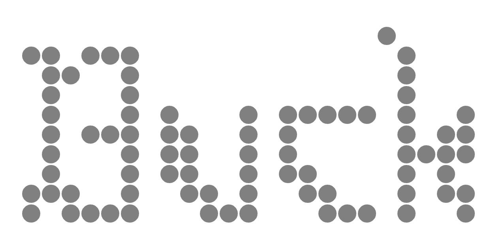

So I've been working on this app. Application bundling is a whole another story. Thanks to modern AI systems, I've been able to pull together a working product in a matter of months. The only thing is , I am not a Frontend guy. No history whatsoever of designing a full fledged frontend webapps. The only thing I know is HTML/CSS and a bit of JS. (did a short react course years ago and have managed to pull up static websites using jekyll but that's pretty much it).


A quick glimse of what I've been working on.


and I'm thiking of calling it BuckBuck.ai. 
Now on logo designing part, I have been fiddleing around with these svg editors available online. But I want to understand the basics of how these things work. For new designers (nto sure if I can call myself one) , it's always a good idea to understand the basics of design.
But it always starts with playng around with colors , fonts and typography.

I have been a fan of this free design tool by a German Company called [schultzschultz](https://schultzschultz.com/) . The *vibe* I think I'm going for is


Vs



I don't know if it is any good. But I like it as a start. And btw what the heck is that?

## Design
I've always been into design. The idea intrigues me. There is no definition of what term design amounts to. But I feel it's a combination of pretty much everything ranging from color theory, typography, layout, user experience and so on.


So I decided to take a short detour and understand the basics of modern web design. So that's what I'm spending this weekend on.


---

## 1. SVG 

or Scalable Vector Graphics [^1] is an XML based markup language for describing two dimensional vector graphics. Unlike raster images which are pixel based, SVGs are vector based and hence can be scaled to any size without loss of quality. This makes them ideal for web use where images need to be displayed on a variety of devices with different screen sizes and resolutions.

fun thing is: they are programmable. You can create and manipulate SVG images using code.

The SVG format supports a wide range of features including shapes, paths, text, gradients, and filters. It also supports interactivity and animation, making it a powerful tool for creating dynamic graphics on the web.

----

- SVGs are very powerful and flexible tools in designing web graphics. Combined with animations and css, it's just a matter of time before you can create some really cool stuff.


### 1.1 So how it works?

We define an svg element with its `width` and `height` properties. This defines the drawing canvas where the coordinates go from the 0,0 coordinate from the `top-left` corner and grow downwards and to the right. 

This is like a cartesian plane but with y axis inverted.


In whole `<html> <head>` structure of a webpage, SVGs are embedded just using a `<svg>` tag. 

Basic structure steps of creating an SVG graphics.[^2]

```html
<svg width="200" height="200">
  <!-- Canvs -->
</svg>
```


Next we start filling the canvas with shapes. The most basic shape is a rectangle. 


----


{: .left width="250px" height="250px"}

 Simple rectangle with x,y coordinates `x 10 y 10` in a box of height and width `200`

```html
<svg width="200" height="200">
  <rect x="10" y="10" width="50" height="50" fill="blue" />
</svg>
```

-----
<br> 


{: .right width="250px" height="250px"}


----
```html
<svg width="200" height="200">
  <circle
    cx="100"
    cy="120"
    r="70"
  />
</svg>
```

-----


Finally to add some colour, use `fill` property. Can use hex codes or rgb values or simply color names.

{: .right width="300px" height="300px"}

1. [SVG Tutorial](https://svg-tutorial.com/) gives an in depth overview of svg elements along with examples ranging from basic to advanced topics.

Best to play around with it. (editable codepen below). Like the great man once said , "Edit and rerun. Conquer the world."

<br>
<br>
<br>

---

<p class="codepen" data-height="300" data-theme-id="dark" data-default-tab="html,result" data-slug-hash="OPyqJRG" data-pen-title="Untitled" data-editable="true" data-user="vKoder" style="height: 300px; box-sizing: border-box; display: flex; align-items: center; justify-content: center; border: 2px solid; margin: 1em 0; padding: 1em;">
  <span>See the Pen <a href="https://codepen.io/vKoder/pen/OPyqJRG">
  Untitled</a> by Vaibhav (<a href="https://codepen.io/vKoder">@vKoder</a>)
  on <a href="https://codepen.io">CodePen</a>.</span>
</p>
<script async src="https://public.codepenassets.com/embed/index.js"></script>

---


Now for more complicated shapes, we don't always use coordianate system tarting from top left `0, 0` . We use something called `viewbox` , to define a coordinate system.

{: .right width="400px" height="400px" caption="viewbox defined as -100 -100 200 200"}
<!-- _[source](https://developer.mozilla.org/en-US/docs/Web/SVG/Attribute/viewBox)_ -->


So in essence, it's to define the area of the canvas and then `shift` the starting point/point of reference.

**viewbox** attribute is defined as `{ min-x ,min-y } { width ,height }` where `min-x` and `min-y` define the top left corner of the viewbox and `width` and `height` define the dimensions of the viewbox.

- This even helps in `scaling` the contents inside the viewbox. So for a canvas dimension of `200 x 200` , if we define a viewbox of `0 0 100 100` , the contents inside the viewbox will be scaled to fit the canvas i.e. `100 x 100` viewbox will be scaled to fit `200 x 200` canvas.


<br>
<br>

---


### 1.2 Paths and Splines

Paths are the most powerful and complex element in SVG. They are used to create complex shapes and curves that cannot be created using basic shapes like rectangles and circles. Paths are defined using a series of commands and parameters that describe the shape of the path.

So what do I mean by that? Well, paths are defined using a `d` attribute (for `definition`) which contains a series of commands and parameters that describe the shape of the path. It's quite similar to turtle graphics if you have ever used it. (Good old COBOL days :P)

----

```html 
<svg
  width="200"
  height="200"
  viewBox="-100 -100 200 200"
><rect x="-100" y="-100" width="200" height="200" 
rx="10" ry="10" fill="white"/>
  <path
    d="
        M -45, -45
        L  45, -45"
    stroke="#ab2727ff"
    stroke-width="15"
    stroke-linecap="round"
  />
</svg>
```
{: .right width="200px" height="200px"}

<br>

<svg
  width="200"
  height="200"
  viewBox="-100 -100 200 200"
><rect x="-100" y="-100" width="200" height="200" 
rx="10" ry="10" fill="white"/>
  <path
    d="
        M -45, -45
        L  45, -45"
    stroke="#ab2727ff"
    stroke-width="15"
    stroke-linecap="round"
  />
</svg>
<br>
<br>

----


- `M` command moves the pen to a new location without drawing anything. In this case, it moves the pen to the coordinates (-45, -45). This is the starting point of the path w.r.t. the `{-100, -100}` topleft corner of the viewbox.
- `L` command draws a straight line from the current pen position to the specified coordinates. In this case, it draws a line from (-45, -45) to (45, -45). Move horizontally `90` units to the right i.e. from `-45` to `45` on x axis.

- `stroke` attribute defines the color of the line. Here it's a shade of red.
- `stroke-width` attribute defines the thickness of the line. Here it's set to 15 units.
- `stroke-linecap` attribute defines the shape of the ends of the line. Here it's set to "round", which means the ends of the line will be rounded.

> MoveTo commands can be used via both `M` and `m`. Also 'L' and 'l' are used for lineTo commands. The difference is that uppercase letters denote absolute coordinates, while lowercase letters denote relative coordinates. For example, `M 10 10` moves the pen to the absolute coordinates (10, 10), while `m 10 10` moves the pen 10 units to the right and 10 units down from its current position.
{: .prompt-tip }

----

#### 1.2.1 Enough chatter, time to dive in.

Following the design patterns as explained [here](https://www.aleksandrhovhannisyan.com/blog/svg-tutorial/) , I am going to make simple logos using paths.

Following steps: 

1. Create a canvas of `200 x 200` with a viewbox of `-100 -100 200 200`
2. Draw a horizontal line from `(-45, -45)` to `(45, -45)`
3. Draw a vertical line from `(-45, -45)` to `(-45, 45)`
4. Draw a Diagonal line from `(-45, -45)` to `(45, 45)`


----


```html
<svg
  width="200"
  height="200"
  viewBox="-100 -100 200 200"
><rect x="-100" y="-100" width="200" height="200" 
 rx="10" ry="10" fill="white"/>
  <path
    d="
        M -45, -45
        L  45, -45
        M -45, -45
        L -45,  45
        M  -45, -45
        L  45, 45
    "
    stroke="#ab2727ff"
    stroke-width="15"
    stroke-linecap="round"
  />
</svg>
```
{: .right width="200px" height="200px"}


**Example 1**
<br>
<svg
  width="200"
  height="200"
  viewBox="-100 -100 200 200"
><rect x="-100" y="-100" width="200" height="200" rx="10" ry="10" fill="white"/>
  <path
    d="
        M -45, -45
        L  45, -45
        M -45, -45
        L -45,  45
        M  -45, -45
        L  45, 45
    "
    stroke="#ab2727ff"
    stroke-width="15"
    stroke-linecap="round"
  />
</svg>
<br>
<br>

----


```html
<svg
  width="200"
  height="200"
  viewBox="-100 -100 200 200"
><rect x="-100" y="-100" width="200" height="200" 
rx="10" ry="10" fill="white"/>
  <path
    d="
        M 45, -45
        L  45, 45
        M 45, -45
        L -45,  -45
        M  45, -45
        L  -45, 45
    "
    stroke="#ab2727ff"
    stroke-width="15"
    stroke-linecap="round"
  />
</svg>
```
{: .right width="200px" height="200px"}


**Example 2**
<br>
<svg
  width="200"
  height="200"
  viewBox="-100 -100 200 200"
><rect x="-100" y="-100" width="200" height="200" 
rx="10" ry="10" fill="white"/>
  <path
    d="
        M 45, -45
        L  45, 45
        M 45, -45
        L -45,  -45
        M  45, -45
        L  -45, 45
    "
    stroke="#ab2727ff"
    stroke-width="15"
    stroke-linecap="round"
  />
</svg>
<br>
<br>

----


```html
<div>
<svg
  width="200"
  height="200"
  viewBox="-100 -100 200 200"
  xmlns="http://www.w3.org/2000/svg"

><rect x="-100" y="-100" width="200" height="200" 
rx="10" ry="10" fill="#ffffffff"/>
  <path
    d="
        M 75, -75
        L  75, -25
        M 75, -75
        L  25, -75 
        M 75, -75
        L 25, -25

    "
    stroke="#ab2727ff"
    stroke-width="10"
    stroke-linecap="round"
  />

    <path
    d="
        M -75, -75
        L  -25, -75
        M -75, -75
        L  -75, -25 
        M -75, -75
        L -25, -25

    "
    stroke="#ab2727ff"
    stroke-width="10"
    stroke-linecap="round"
  />

      <path
    d="
        M -75, 75
        L  -75, 25
        M -75, 75
        L  -25, 75 
        M -75, 75
        L -25, 25

    "
    stroke="#ab2727ff"
    stroke-width="10"
    stroke-linecap="round"
  />

        <path
    d="
        M 75, 75
        L  75, 25
        M 75, 75
        L  25, 75 
        M 75, 75
        L 25, 25

    "
    stroke="#ab2727ff"
    stroke-width="10"
    stroke-linecap="round"
  />
</svg>
</div>
```
{: .right .scroll width="200px" height="200px"}


**Example 3**
<br>
<div>
<svg
  width="200"
  height="200"
  viewBox="-100 -100 200 200"
  xmlns="http://www.w3.org/2000/svg"
>
<rect x="-100" y="-100" width="200" height="200" rx="10" ry="10" fill="#ffffffff"/>
  <path
    d="
        M 75, -75
        L  75, -25
        M 75, -75
        L  25, -75 
        M 75, -75
        L 25, -25

    "
    stroke="#ab2727ff"
    stroke-width="10"
    stroke-linecap="round"
  />

    <path
    d="
        M -75, -75
        L  -25, -75
        M -75, -75
        L  -75, -25 
        M -75, -75
        L -25, -25

    "
    stroke="#ab2727ff"
    stroke-width="10"
    stroke-linecap="round"
  />

      <path
    d="
        M -75, 75
        L  -75, 25
        M -75, 75
        L  -25, 75 
        M -75, 75
        L -25, 25

    "
    stroke="#ab2727ff"
    stroke-width="10"
    stroke-linecap="round"
  />

        <path
    d="
        M 75, 75
        L  75, 25
        M 75, 75
        L  25, 75 
        M 75, 75
        L 25, 25

    "
    stroke="#ab2727ff"
    stroke-width="10"
    stroke-linecap="round"
  />
</svg>
</div>
<br>
<br>

---


<!-- <div>
  <style>
   #windmill-head {
  animation-name: rotate;
  animation-duration: 4s;
  animation-iteration-count: infinite;
  animation-timing-function: linear;
}

@keyframes rotate {
  from {
    transform: rotate(0deg);
  }
  to {
    transform: rotate(360deg);
  }
}
    }
  </style><svg
  width="300"
  height="400"
  viewBox="-100 -200 200 400"
  fill="rgba(255, 0, 0, 0.5)"
  xmlns="http://www.w3.org/2000/svg"
>

  <g transform="translate(0, -50)">
    <g id="windmill-head">
      <circle r="8" />

      <path id="arm" d="M -7 -20 C -7 -10 7 -10 7 -20 L 2 -80 L -2 -80" />
      <use href="#arm" transform="rotate(+120)" />
      <use href="#arm" transform="rotate(-120)" />
    </g>
  </g>

  <path d="M -7 100 L 7 100 L 3 -35 L -3 -35" />
</svg>
  </div>
{: .right width="200px" height="400px"}

--- -->


<!-- > An example showing the `tip` type prompt.
{: .prompt-tip } -->

> LineTo commands are `L` and  `l`. But `H` and `h` are used for horizontal lines and `V` and `v` are used for vertical lines. The difference is that uppercase letters denote absolute coordinates, while lowercase letters denote relative coordinates. For example, `H 50` draws a horizontal line to the absolute x-coordinate of 50, while `h 50` draws a horizontal line 50 units to the right from the current position.
{: .prompt-tip }


> This took total of `12` line segments and `12` mvoing the tip of the pen.
{: .prompt-warning }

> This is definitely not the best way to go forward.

Alright, thankfully we can use `polylines` to reduce the number of move & draw routine.

#### 1.2.2 Polylines

The SVG <polyline> element is a basic SVG shape used to create a series of connected straight lines. It differs from the <line> element in that it can connect multiple points, whereas <line> only connects two.

1. **points Attribute**:
This is the most crucial attribute, defining the vertices of the polyline. It takes a list of `x` and `y` coordinate pairs, separated by spaces. For example, `points="10,10 50,20 30,60" ` would create a polyline connecting `(10,10)` to `(50,20)` and then to `(30,60)`.

2. **Stroke Properties**:
`stroke`: Sets the color of the line.
`stroke-width`: Sets the thickness of the line.
`stroke-linecap`: Determines the shape of the line endings (e.g., butt, round, square).
`stroke-linejoin`: Determines the shape of the corners where lines meet (e.g., miter, round, bevel).
3. **Fill Properties**:
`fill`: Specifies the color used to fill the area enclosed by the polyline. If the polyline is not a closed shape (i.e., the last point is not connected to the first), the fill will connect the starting and ending points along the closest path. Setting fill="none" removes the fill.

---


```html
<svg width="200" height="200">
    <rect x="-100" y="-100" width="200" height="200" 
fill="white"/>
  <polyline points="20,20 40,25 60,40 80,
  120 120,140 140,180"
 style="fill:none;stroke:blue;stroke-width:3" />
</svg>

```
{: .right width="200px" height="200px"}


**Example :**
<div>
<style>
polyline {
  stroke-linejoin: round;
  stroke-linecap: round;
  fill: none;
  stroke: blue;
  stroke-width: 3;
}
  </style>
<svg width="200" height="200" >
<rect x="0" y="0" width="200" height="200" 
fill="white" rx="10" ry="10"/>
  <polyline points="20,20 40,25 60,40 80,120 120,140 140,180" />
</svg>


</div>
<br>

---

> `stroke-linejoin`: controls the rounding of corners in paths. It’s set to miter by default, which means corners are sharp. You can use round to create rounded corners.
`stroke-linecap`: controls the rounding of terminal paths (“caps”), like on the ends of lines or polylines. Its default is butt, which gives you flat terminal ends. If you set it to round, you’ll get rounded terminals.
{: .prompt-tip }


> Polylines are a great way to reduce the number of commands needed to draw complex shapes. However, they are limited to straight lines only. For curves, we need to use Bezier curves or arcs.
{: .prompt-warning }

#### 1.2.3 Bezier Curves
Bezier curves are parametric curves used in computer graphics and related fields to produce smooth and scalable curves. They are defined by a set of control points, which determine the shape of the curve. The most common types of Bezier curves are quadratic and cubic Bezier curves.


##### 1. **Quadratic Bezier Curves**:
A `quadratic Bezier curve` is defined by three points: a starting point, an ending point, and a single control point. The curve starts at the starting point, is pulled towards the control point, and ends at the ending point.  
The SVG command for a quadratic Bezier curve is `Q` (absolute) or `q` (relative). The syntax is as follows:

```html
Q control-point-x control-point-y end-point-x end-point-y
```

For example, `Q 50 0 100 100` draws a quadratic Bezier curve from the current point to (100, 100) with a control point at (50, 0).

--- 

```html
<svg width="200" height="200">
  <path d="M 10 80 Q 95 10 180 80" stroke="black" 
  fill="transparent"/>
</svg>
```
{: .right width="200px" height="200px"}

**Example : Quadratic Bezier Curve**
<br>
<div>
<svg width="200" height="100">
<rect x="0" y="0" width="200" height="100" 
fill="white" rx="10" ry="10"/>
  <path d="M 10 80 Q 95 10 180 80" stroke="black" fill="transparent"/>
</svg>
</div>
<br>
<br>  

---

##### 2. **Cubic Bezier Curves**:
A `cubic Bezier curve` is defined by four points: a starting point, an ending point, and two control points. The curve starts at the starting point, is influenced by both control points, and ends at the ending point.  
The SVG command for a cubic Bezier curve is `C  ` (absolute) or `c` (relative). The syntax is as follows:


```html
C control-point1-x control-point1-y control-point2-x control-point2-y end-point-x end-point-y
```

For example, `C 50 0 150 200 200 100` draws a cubic Bezier curve from the current point to (200, 100) with control points at (50, 0) and (150, 200).    


```html
<svg width="200" height="200">
    <rect x="0" y="0" width="200" height="180" 
fill="white" rx="10" ry="10"/>
  <path d="M 10 80 C 40 10, 65 10, 95 80 S 150 150,
   180 80" 
  stroke="black" fill="transparent"/>
</svg>
```
{: .right width="200px" height="200px"}

**Example : Cubic Bezier Curve**
<br>
<div>
<svg width="200" height="200">
<rect x="0" y="0" width="200" height="180" 
fill="white" rx="10" ry="10"/>
  <path d="M 10 80 C 40 10, 65 10, 95 80 S 150 150, 180 80" 
  stroke="black" fill="transparent"/>
</svg>
</div>


---


> Bezier curves are widely used in computer graphics, animation, and user interface design due to their flexibility and ease of use. They allow designers to create smooth and complex shapes with just a few control points.


...


Sources:

----


[^1]:[SVG on MDN](https://developer.mozilla.org/en-US/docs/Web/SVG)

[^2]:[svg-file](https://www.snoweb.io/en/web-design/svg-file/#edition-logiciel)

[^3]:[Glyphs](https://blag.bapt.xyz/posts/handwriting/)

[SVG Viewer](https://www.svgviewer.dev/)

[JS Animation](https://javascript.info/animation)